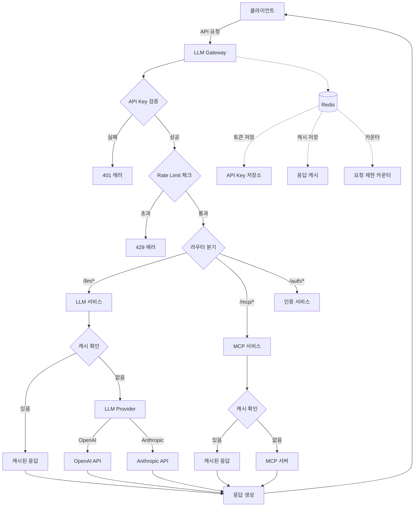

# LLM Gateway 로직 흐름 가이드

## 🎯 전체 시스템 흐름도



## 🔑 Gateway의 핵심 역할

이 Gateway는 **순수 프록시 서버**로 다음 3가지 역할만 수행합니다:

1. **인증 게이트키퍼**: API Key로 접근 제어
2. **LLM 프록시**: OpenAI/Anthropic API 중계
3. **MCP 브릿지**: 백엔드 서버와 통신

사용자 관리나 비즈니스 로직은 없습니다.

## 📋 주요 시나리오별 흐름

### 1. API 키 발급 (사용자 정보 불필요)

```
1. 클라이언트가 API 키 생성 요청
   POST /api/v1/auth/api-key/generate
   
2. 서버가 고유한 API 키 생성
   형식: tlx_[32자리 랜덤 문자열]
   예시: tlx_a1b2c3d4e5f6g7h8i9j0k1l2m3n4o5p6

3. Redis에 최소 정보만 저장
   Key: token:tlx_xxxxx
   Value: 고유 ID (UUID)
   TTL: 1년

4. 클라이언트에게 API 키 반환
   이후 모든 요청에 X-API-Key 헤더로 전송
```

### 2. LLM 채팅 요청 처리

```
1. 클라이언트가 API 키와 함께 채팅 요청
   POST /api/v1/llm/chat
   헤더: X-API-Key: tlx_xxxxx
   바디: {
     "provider": "openai",
     "model": "gpt-3.5-turbo",
     "messages": [...]
   }

2. API Key 검증 (src/middleware/auth.ts)
   - 형식 체크: tlx_ 접두사 + 32자리
   - Redis 조회: 키가 존재하는지 확인
   - 없으면 401 Unauthorized

3. Rate Limit 체크 (src/middleware/rateLimiter.ts)
   - Redis 카운터 증가
   - 기본: 분당 100회
   - 초과시 429 Too Many Requests

4. 캐시 확인 (temperature=0인 경우만)
   - 동일 요청 해시 생성
   - Redis에서 캐시 조회
   - 있으면 즉시 반환 (API 호출 없음)

5. LLM API 호출
   - OpenAI: https://api.openai.com/v1/chat/completions
   - Anthropic: https://api.anthropic.com/v1/messages

6. 응답 처리
   - 캐싱 (5분)
   - 토큰 사용량 기록
   - 클라이언트 반환
```

### 3. MCP 도구 실행

```
1. 클라이언트가 MCP 도구 호출 요청
   POST /api/v1/mcp/tools/call
   헤더: X-API-Key: tlx_xxxxx
   바디: {
     "name": "get_appraisals",
     "arguments": {...}
   }

2. 인증 → Rate Limit (위와 동일)

3. MCP 서버 통신
   - 대상: http://localhost:4000 (설정 가능)
   - 평가 데이터 조회
   - 응답 결과 처리

4. 결과 캐싱
   - 5분간 동일 요청 캐시
   - 서버 부하 감소

5. 클라이언트 응답
```

## 🔍 코드 구조와 흐름

### 디렉토리 구조
```
src/
├── middleware/          # 요청 전처리
│   ├── auth.ts         # API Key 검증
│   ├── rateLimiter.ts  # 요청 제한
│   └── validation.ts   # 입력 검증
├── routes/             # API 엔드포인트
│   ├── auth.ts        # /auth/* - API Key 관리
│   ├── llm.ts         # /llm/* - LLM 프록시
│   └── mcp.ts         # /mcp/* - MCP 중계
├── services/           # 비즈니스 로직
│   ├── llm/           # LLM 프로바이더
│   └── mcp/           # MCP 클라이언트
└── utils/             # 유틸리티
    ├── redis.ts       # Redis 연결
    └── logger.ts      # 로깅
```

### 요청 처리 파이프라인

```
[요청] → [Express 미들웨어] → [라우터] → [서비스] → [외부 API] → [응답]
         ↓                    ↓          ↓           ↓
         CORS                Auth      Cache      OpenAI/MCP
         Body Parser         Rate Limit  Logic     Anthropic
         Compression         Validation
```

## 🧪 실제 요청 흐름 예시

### 예시: "안녕하세요"를 OpenAI에게 전달

```
1. [클라이언트 요청]
   POST http://localhost:1111/api/v1/llm/chat
   Headers: 
     X-API-Key: tlx_a1b2c3d4e5f6g7h8i9j0k1l2m3n4o5p6
     Content-Type: application/json
   Body:
     {
       "provider": "openai",
       "model": "gpt-3.5-turbo",
       "messages": [
         {"role": "user", "content": "안녕하세요"}
       ]
     }

2. [Express 기본 미들웨어] src/app.ts
   → Helmet: 보안 헤더 설정
   → CORS: localhost:1111 허용 확인
   → Body Parser: JSON 파싱
   → Morgan: 요청 로깅

3. [인증 미들웨어] src/middleware/auth.ts:14-52
   → API Key 추출: req.headers['x-api-key']
   → 형식 검증: /^tlx_[a-f0-9]{32}$/
   → Redis 조회: GET token:tlx_a1b2c3d4...
   → 성공: req.user = { id: "uuid", apiKey: "tlx_..." }

4. [Rate Limit] src/middleware/rateLimiter.ts:22-60
   → Redis 카운터: INCR rate:user:uuid
   → 현재 카운트: 15/100
   → 헤더 설정: X-RateLimit-Remaining: 85

5. [유효성 검사] src/middleware/validation.ts
   → provider ∈ ['openai', 'anthropic'] ✓
   → model = 'gpt-3.5-turbo' ✓
   → messages.length > 0 ✓

6. [라우터] src/routes/llm.ts:23-60
   → 엔드포인트 매칭: POST /chat
   → 서비스 호출: llmService.chat()

7. [LLM 서비스] src/services/llm/index.ts:35-65
   → 캐시 키 생성: llm:base64(request_hash)
   → Redis 캐시 확인: GET cache:llm:xxx
   → 캐시 미스 → OpenAIProvider 호출

8. [OpenAI Provider] src/services/llm/openai.ts:8-45
   → API 호출: POST https://api.openai.com/v1/chat/completions
   → 헤더: Authorization: Bearer sk-...
   → 응답 수신: "안녕하세요! 무엇을 도와드릴까요?"

9. [응답 처리] 
   → 캐싱: SET cache:llm:xxx (TTL: 300초)
   → 사용량: HINCRBY usage:uuid:openai:2024-01-12
   → 응답: 200 OK + JSON 데이터

10. [클라이언트 수신]
    {
      "id": "chatcmpl-xxx",
      "model": "gpt-3.5-turbo",
      "choices": [{
        "message": {
          "role": "assistant",
          "content": "안녕하세요! 무엇을 도와드릴까요?"
        }
      }],
      "usage": {
        "promptTokens": 10,
        "completionTokens": 15,
        "totalTokens": 25
      }
    }
```

## 💡 디버깅 팁

### 1. 로그 추적
```bash
# 개발 모드 실행
npm run dev

# 로그 파일 실시간 확인
tail -f logs/combined.log

# 에러만 보기
tail -f logs/error.log
```

### 2. Redis 모니터링
```bash
# Redis CLI 접속
redis-cli

# 모든 키 확인
KEYS *

# API Key 확인
GET token:tlx_xxxxx

# Rate Limit 확인
GET rate:user:uuid

# 캐시 확인
GET cache:llm:xxxxx
```

### 3. 중단점 디버깅
VS Code에서:
1. 왼쪽 줄 번호 클릭 → 빨간 점(중단점)
2. F5 → "Debug Server" 선택
3. 요청 보내면 중단점에서 멈춤
4. 변수 확인, 단계별 실행

### 4. 네트워크 추적
Chrome DevTools:
1. F12 → Network 탭
2. API 요청 확인
3. Headers, Response 확인

## 🚀 성능 최적화 포인트

1. **캐싱 전략**
   - temperature=0: 결정적 응답 → 캐싱
   - MCP 데이터: 5분 캐싱
   - 도구 목록: 1시간 캐싱

2. **Rate Limiting**
   - 일반: 분당 100회
   - 엄격: 분당 10회 (인증)
   - 느슨: 분당 200회 (조회)

3. **Connection Pooling**
   - Redis: ioredis 자동 풀링
   - HTTP: axios 연결 재사용

## 🔒 보안 체크리스트

✅ API Key 형식 검증 (tlx_ 접두사)
✅ Rate Limiting으로 남용 방지
✅ 입력 Sanitization (XSS 방지)
✅ CORS 설정 (허용 도메인만)
✅ Helmet으로 보안 헤더
✅ 환경 변수로 민감 정보 관리
✅ HTTPS 권장 (프로덕션)

## 📊 모니터링 지표

- **응답 시간**: 평균 < 500ms
- **캐시 적중률**: > 30%
- **Rate Limit 위반**: < 1%
- **에러율**: < 0.1%
- **토큰 사용량**: 일별/사용자별 추적

## 🎓 학습 경로

1. **기본 이해**
   - 이 문서 전체 읽기
   - test-flow.http 실행

2. **코드 탐색**
   - src/index.ts → app.ts → routes/* 순서로
   - 각 미들웨어 역할 이해

3. **실습**
   - API Key 생성
   - 간단한 채팅 요청
   - Rate Limit 테스트

4. **심화**
   - 새 LLM Provider 추가
   - 커스텀 미들웨어 작성
   - 캐싱 전략 수정