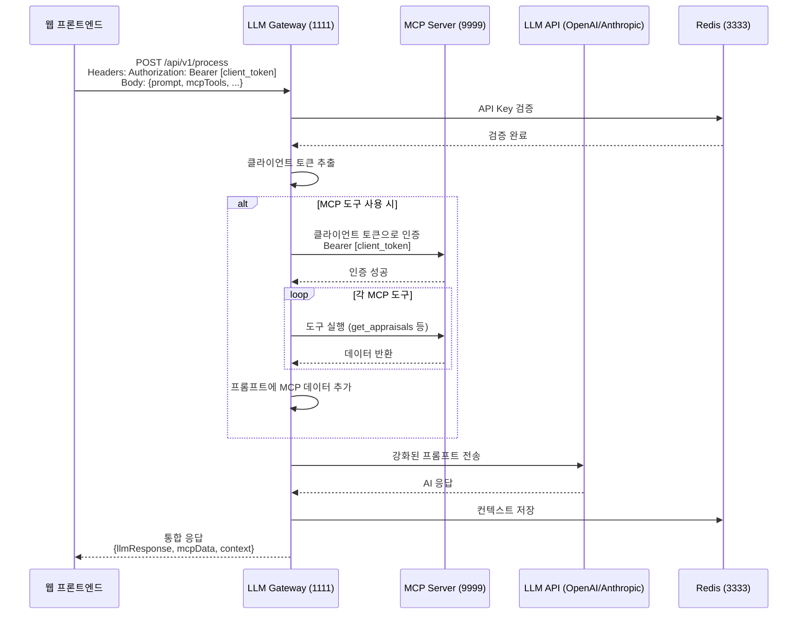

# 통합 처리 플로우 가이드

## 🎯 핵심 플로우



## 🔄 실제 처리 흐름

### 1️⃣ 클라이언트 요청
```javascript
// 웹 프론트엔드에서 요청
fetch('http://localhost:1111/api/v1/process', {
  method: 'POST',
  headers: {
    'X-API-Key': 'tlx_xxxxx',  // Gateway 인증용
    'Authorization': 'Bearer eyJxxxxx',  // 클라이언트 토큰 (MCP용)
    'Content-Type': 'application/json'
  },
  body: JSON.stringify({
    prompt: "최근 평가 결과를 분석해주세요",
    mcpTools: ["get_appraisals"],  // 사용할 MCP 도구
    provider: "openai",
    model: "gpt-3.5-turbo"
  })
})
```

### 2️⃣ Gateway 처리
```typescript
// src/services/orchestrator.ts
class Orchestrator {
  async process(request) {
    // 1. 클라이언트 토큰으로 MCP 인증
    await mcpClient.setAuthToken(request.clientToken);
    
    // 2. MCP 도구 실행하여 데이터 수집
    const mcpData = await this.executeMCPTools(['get_appraisals']);
    
    // 3. 수집된 데이터를 프롬프트에 추가
    const enrichedPrompt = `
      ${request.prompt}
      
      === 평가 데이터 ===
      ${JSON.stringify(mcpData)}
      === 데이터 끝 ===
    `;
    
    // 4. LLM에 전달하여 분석
    const llmResponse = await llmService.chat('openai', {
      messages: [{ role: 'user', content: enrichedPrompt }]
    });
    
    return { llmResponse, mcpData };
  }
}
```

### 3️⃣ 응답 구조
```json
{
  "llmResponse": {
    "id": "chatcmpl-xxx",
    "choices": [{
      "message": {
        "role": "assistant",
        "content": "평가 결과를 분석해보면..."
      }
    }],
    "usage": {
      "totalTokens": 500
    }
  },
  "mcpData": {
    "get_appraisals": {
      "total_count": 10,
      "appraisals": [...]
    }
  },
  "context": {
    "contextId": "context:1234567890",
    "processingTime": 2500,
    "toolsUsed": ["get_appraisals"]
  },
  "timestamp": "2024-01-12T10:30:00.000Z"
}
```

## 🔑 핵심 특징

### 토큰 재활용
- **X-API-Key**: Gateway 자체 인증
- **Authorization**: 클라이언트 토큰을 그대로 MCP에 전달
- 클라이언트의 권한으로 MCP 데이터 접근

### 데이터 통합
1. MCP에서 실시간 데이터 수집
2. 프롬프트에 데이터 주입
3. LLM이 데이터 기반 응답 생성

### 컨텍스트 관리
- 각 요청의 전체 컨텍스트 Redis 저장
- contextId로 나중에 조회 가능
- 대화 연속성 유지

## 📝 API 엔드포인트

### 통합 처리
```
POST /api/v1/process
```
- MCP 도구 실행 + LLM 처리
- 클라이언트 토큰 재활용
- 통합 응답 반환

### 단순 프롬프트
```
POST /api/v1/prompt
```
- MCP 없이 LLM만 사용
- 빠른 응답

### 도구 목록
```
GET /api/v1/available-tools
```
- 클라이언트 토큰으로 사용 가능한 MCP 도구 조회

### 컨텍스트 조회
```
GET /api/v1/context/:contextId
```
- 이전 요청의 전체 컨텍스트 조회

## 🚀 실행 예시

### 평가 데이터 분석
```bash
curl -X POST http://localhost:1111/api/v1/process \
  -H "X-API-Key: tlx_xxxxx" \
  -H "Authorization: Bearer eyJxxxxx" \
  -H "Content-Type: application/json" \
  -d '{
    "prompt": "팀의 평가 점수 평균과 트렌드를 분석해주세요",
    "mcpTools": ["get_appraisals", "get_response_results"],
    "provider": "openai",
    "model": "gpt-3.5-turbo",
    "temperature": 0.5
  }'
```

### 스트리밍 응답
```javascript
const eventSource = new EventSource('http://localhost:1111/api/v1/process');

eventSource.onmessage = (event) => {
  const data = JSON.parse(event.data);
  
  if (data.type === 'mcp_data') {
    console.log('MCP 데이터:', data.data);
  } else if (data.type === 'llm_chunk') {
    console.log('LLM 청크:', data.content);
  }
};
```

## 🔒 보안 고려사항

1. **이중 인증**
   - Gateway: API Key (tlx_)
   - MCP: 클라이언트 Bearer 토큰

2. **토큰 격리**
   - Gateway는 토큰 전달만
   - 실제 인증은 MCP 서버에서

3. **Rate Limiting**
   - 사용자별 요청 제한
   - 과도한 MCP 호출 방지

## 📊 모니터링

### 로그 확인
```bash
tail -f logs/combined.log | grep "orchestrator"
```

### Redis 모니터링
```bash
redis-cli -p 3333
> KEYS context:*
> GET context:1234567890
```

### 성능 지표
- MCP 도구 실행 시간
- LLM 응답 시간
- 전체 처리 시간
- 토큰 사용량

## 🎯 사용 시나리오

### 1. 실시간 데이터 기반 분석
```
클라이언트: "최근 평가에서 높은 점수를 받은 직원들의 특징은?"
→ MCP: get_appraisals, get_response_results
→ LLM: 데이터 분석 및 인사이트 제공
```

### 2. 맞춤형 리포트 생성
```
클라이언트: "이번 분기 팀 성과 리포트 작성"
→ MCP: 여러 도구로 데이터 수집
→ LLM: 구조화된 리포트 생성
```

### 3. 인터랙티브 Q&A
```
클라이언트: "평가 점수가 가장 낮은 항목은?"
→ MCP: 평가 데이터 조회
→ LLM: 자연어로 답변
```